## 📑 Table of contents

- [📝 Overview](#-overview)
- [Installation](#installation)
- [Input Files Format](#input-files-format)
- [01. Merging Samples](#01-merging-samples)
- [02. Single Cell RNA Sequencing Analysis](#02-single-cell-rna-sequencing-analysis)
- [03. Multiple Datasets Integration](#03-multiple-datasets-integration)
- [04. 3D UMAP and t-SNE Plots](#04-3d-umap-and-t-sne-plots)
- [05. Volcano Plot](#05-volcano-plot)
- [06. Heatmap](#06-heatmap)
- [07. Boxplot](#07-boxplot)
- [📚 Citation](#-citation)
- [🤝 Acknowledgements](#-acknowledgements)


## 📝 Overview
<p align="justify"> <b>scRNA-seq-navigator</b> contains a comprehensive single-cell RNA sequencing (scRNA-seq) analysis pipeline designed for processed data following alignment. The pipeline encompasses data integration, quality control, batch effect correction, cell type annotation, differential gene expression analysis, and multi-dimensional visualization to extract meaningful biological insights from complex single-cell datasets. </p>

- The analyses provides end-to-end solutions for:
    - **Data Integration & Processing:** Merging multiple datasets and experimental conditions
    - **Batch Effect Correction:** Addressing technical variations across different platforms and studies
    - **Cell Type Identification:** Automated annotation using reference gene signatures
    - **Advanced Visualization:** 2D/3D embeddings and interactive plots
    - **Differential Expression:** Statistical analysis of gene expression changes
    - **Publication-ready Outputs:** High-quality figures and comprehensive results
- <p align="justify"> Each script represents a modular component of the analysis workflow, allowing researchers to process single-cell data from raw counts to biological interpretation </p>

| Script | Description |
|--------|-------------|
| `01-samples_merger.R` | Merges multiple scRNA-seq samples from different conditions into a unified dataset for analysis |
| `02-scRNA-seqr.R` | Performs comprehensive scRNA-seq analysis including QC, clustering, cell type annotation, and differential expression analysis |
| `03-multiple-datasets-integrator.R` | Integrates multiple scRNA-seq datasets using Harmony to remove batch effects |
| `04-umap-tsne-3d-plotr.R` | Creates interactive 3D visualizations of UMAP and t-SNE embeddings for enhanced data exploration |
| `05-volcano_plotr.R` | Generates publication-ready volcano plots to visualize differential gene expression results |
| `06-heatmapr.R` | Produces clustered heatmaps showing gene expression patterns across cell types and conditions |
| `07-boxplotr.R` | Creates comparative box plots to analyze gene expression differences across experimental conditions and/or cell types |

## Installation

- Navigate to the directory containing `install_packages.R` file
- Open terminal and run:

```
Rscript install_packages.R
```

- Alternatively, if the above does not work, open `install_packages.R` file in RStudio
- Click the "Source" button in the top-right of the script editor OR in R console run:

```
# Navigate to the script directory first, then:
source("install_packages.R")
```

## Input Files Format

- The analysis workflow is designed for processed scRNA-seq data following alignment.
- Input should be in 10X Genomics format, consisting of the three standard files for each sample directory:
    - `barcodes.tsv.gz`
    - `features.tsv.gz`
    - `matrix.mtx.gz`

## 01. Merging Samples

<p align="justify"> This script performs the initial data integration step for single-cell RNA sequencing (scRNA-seq) analysis by merging multiple samples from two experimental conditions (e.g Normal and Parkinson's Disease) into a unified Seurat object. </p>

### Purpose

- Load individual scRNA-seq samples from both control and diseased conditions
- Merge samples within each condition group
- Combine both condition groups into a final merged dataset
- Add appropriate metadata for sample tracking and condition identification
- Export the consolidated data for downstream analysis

### Workflow

### A. Reading and Creating Seurat Object

```
sample1 <- Read10X(data.dir = "samples/Normal/GSM7290760")
sample1 <- CreateSeuratObject(counts = sample1, project = "N1")
```

- `Read10X()` Reads the 10X Genomics format data from the specified directory containing three essential files: 
    - `barcodes.tsv.gz` (cell identifiers)
    - `features.tsv.gz` (gene information)
    - `matrix.mtx.gz`   (count matrix)
- `CreateSeuratObject()` Converts the raw count data into a Seurat object, which is the standard data structure

### B. Merging Multiple Samples

- Merging all control samples together:

```
normal_merged <- merge(sample1, y = c(sample2, sample3, sample4, sample5),
                       add.cell.ids = c("N1", "N2", "N3", "N4", "N5"))
```

- Merging all diseased samples together:

```
LM_merged <- merge(sample6, y = c(sample7, sample8, sample9, sample10),
                   add.cell.ids = c("LM1", "LM2", "LM3", "LM4", "LM5"))
```

### C. Adding Condition Metadata

- Control samples:

```
normal_merged <- AddMetaData(object = normal_merged,
                             metadata = "Normal", col.name = "condition")
```

- Diseased samples:

```
LM_merged <- AddMetaData(object = LM_merged, 
                         metadata = "LM", col.name = "condition")
```

### D. Final Merging

- Merging control and diseased samples together:

```
merged_samples <- merge(normal_merged, LM_merged)
```

## 02. Single Cell RNA Sequencing Analysis

<p align="justify"> This script performs comprehensive single-cell RNA sequencing analysis from quality control through cell type annotation and differential expression analysis. </p>

### Workflow

### A. Data Loading & Quality Control

- Loads merged dataset from previous script (samples merger)
- Calculates mitochondrial gene percentage
- Visualizes QC metrics using violin plots
- Applies quality filters based on:
    - Gene counts (200-5000 genes per cell)
    - RNA counts (>2000 molecules per cell)
    - Mitochondrial content (<10%)

<div style="display:flex; justify-content:space-between;">
  
  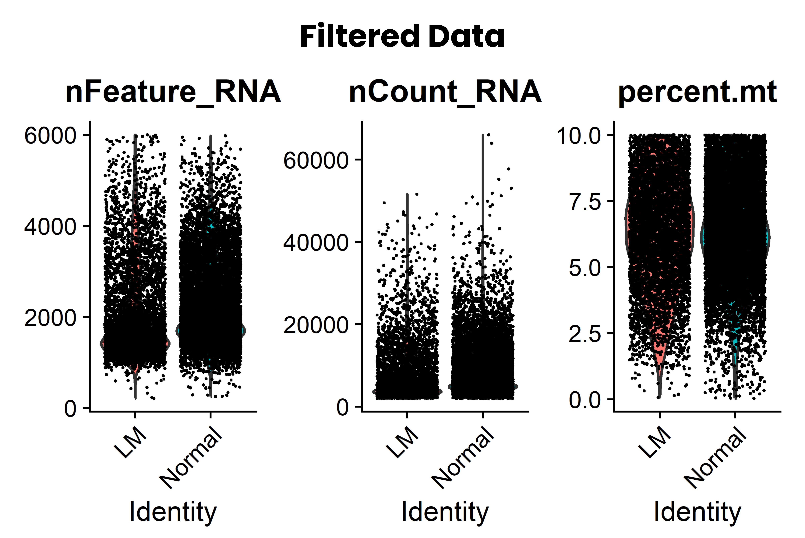
</div>

### B. Data Normalization & Feature Selection

- Normalizes data using log normalization
- Identifies highly variable genes
- Visualizes top variable features

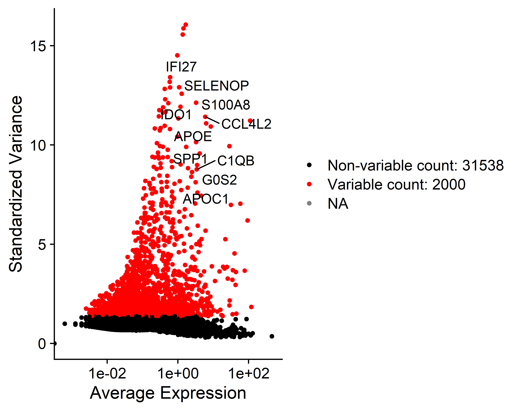

### C. Dimensionality Reduction & Clustering

- Scales data and performs PCA
- Determines optimal dimensions using elbow plot
- Clusters cells using graph-based clustering
- Performs non-linear dimensionality reduction (UMAP & t-SNE)
- Visualizes clusters and conditions

---

### PCA and Elbow Plot

<div style="display:flex; justify-content:space-between;">
  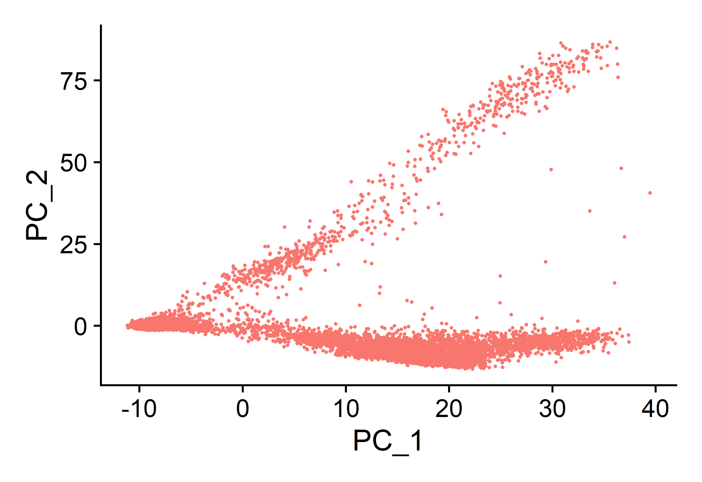
  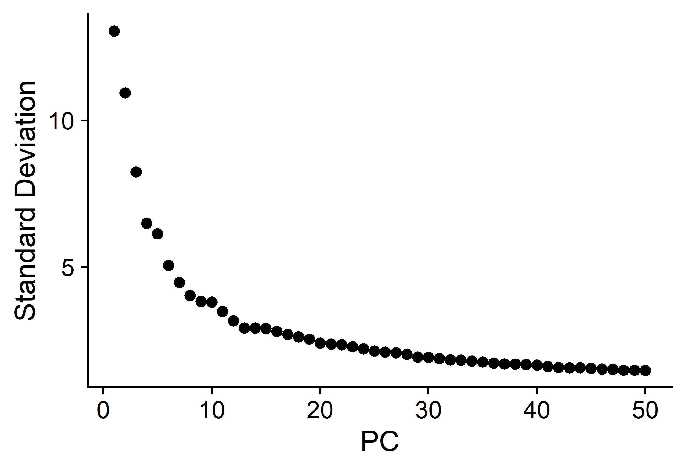
</div>

---

### UMAP and t-SNE - Cell Clusters

<div style="display:flex; justify-content:space-between;">
  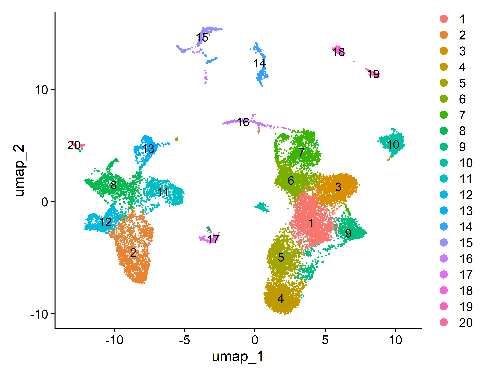
  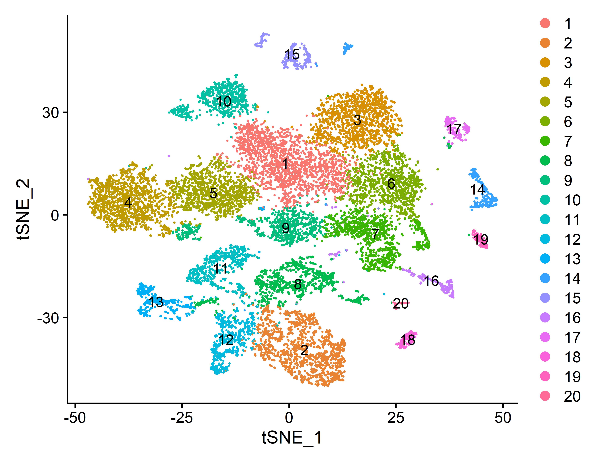
</div>

---

### UMAP - Clusters Grouped By Condition


---

### t-SNE - Clusters Grouped By Condition

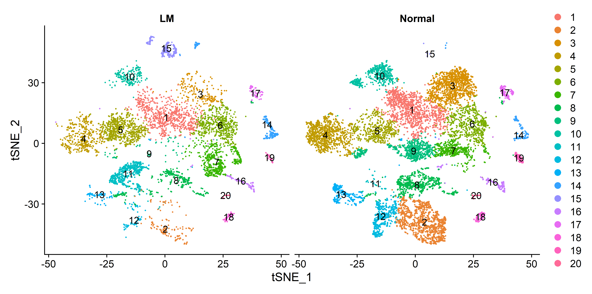

### D. Cell Type Annotation

- Uses ScType database for automated cell type identification
- Annotates clusters based on brain tissue markers
- Assigns cell types and handles low-confidence annotations
- Updates metadata with cell type classifications

---

### UMAP and t-SNE Annotated Cell Clusters

<div style="display:flex; justify-content:space-between;">
  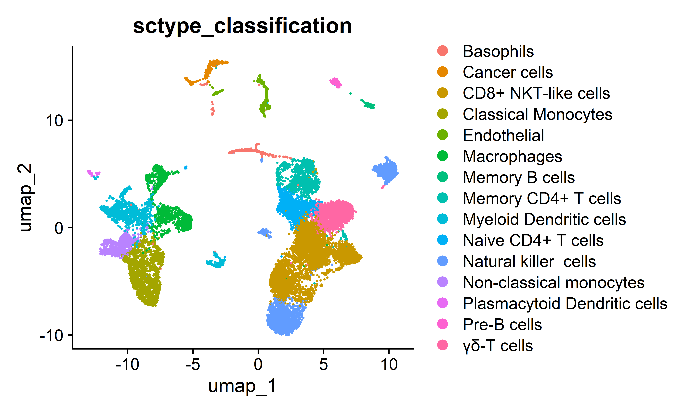
  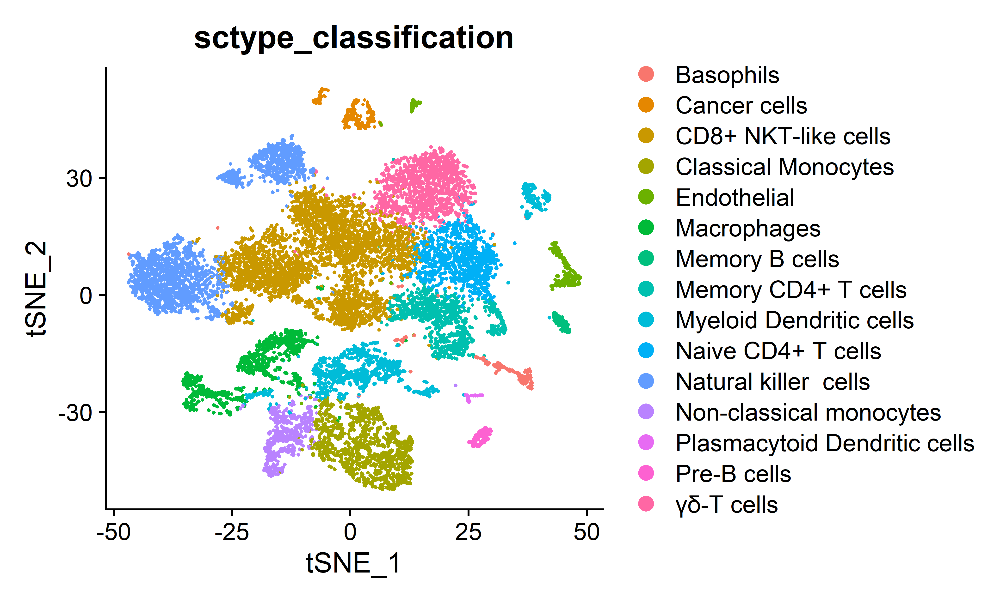
</div>

---

### UMAP - Annotated Cell Clusters Grouped By Condition

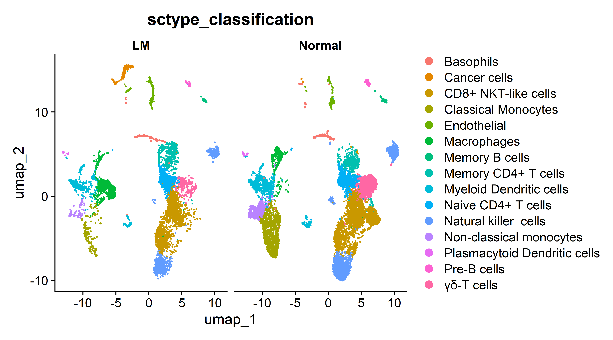

---

### t-SNE - Annotated Cell Clusters Grouped By Condition

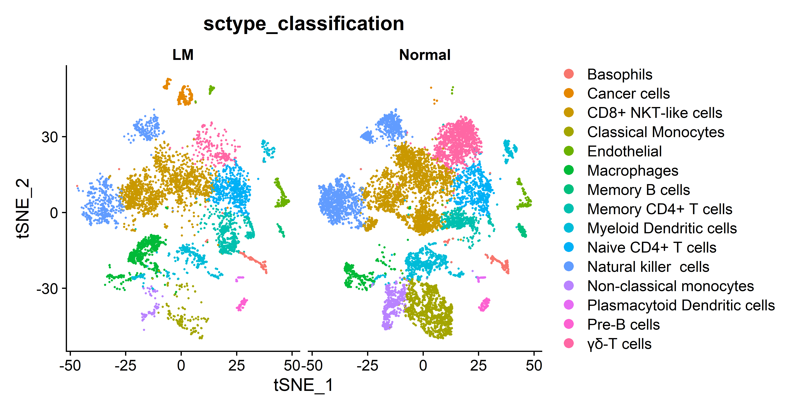

### E. Visualization & Analysis

- Generates annotated UMAP/t-SNE plots
- Creates condition-split visualizations
- Counts cell distribution across types and conditions
- Saves annotated dataset

### F. Differential Expression Analysis

- Subsets specific cell types if needed
- Performs differential expression between:
    - Same cell type across conditions (Normal vs PD)
    - Different cell types within same condition
- Identifies up/down-regulated genes
- Applies statistical filtering and FDR correction
- Exports marker gene lists

### Outputs

- The script produces:
    - Quality control plots
    - Clustering visualizations
    - Annotated cell type maps
    - Differential expression results
    - Processed datasets for downstream analysis (e.g Cell-cell communication, Trajectory analysis etc)

## 03. Multiple Datasets Integration

<p align="justify"> This script performs comprehensive integration of multiple single-cell RNA sequencing datasets to address technical variations while preserving biological signals. </p>

### Workflow

### A. Data Preparation

- Loads and combines samples from multiple experimental datasets
- Adds metadata labels for dataset origin and experimental conditions
- Merges all samples into a unified analysis object

### B. Quality Control & Preprocessing

- Clusters data without batch correction
- Generates low-dimensional embeddings (UMAP/t-SNE) showing raw cluster patterns
- Visualizes inherent batch effects and sample separation

### C. Batch Effect Correction

- Applies advanced integration methods to remove technical variability
- Creates harmonized dimensional space while preserving biological variation
- Maintains dataset-specific biological signals while minimizing batch effects

### E. Integrated Data Analysis

- Re-clusters cells using integrated dimensions
- Generates new embeddings on corrected data
- Creates comparative visualizations showing integration effectiveness

---

### UMAP - Before and After Batch-Effect Correction

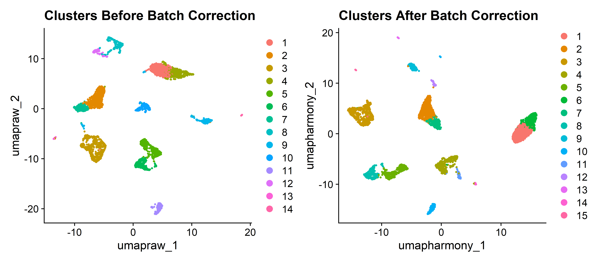

---

### t-SNE - Before and After Batch-Effect Correction


### F. Cell Type Annotation

- Automates cell type identification using reference gene signatures
- Assigns cell types to clusters based on marker expression patterns
- Verifies annotation quality through multiple visualization approaches

### G. Data Exploration & Analysis

- Quantifies cell distribution across types and conditions
- Enables flexible subsetting for focused analysis of specific populations
- Exports fully annotated datasets for further investigation

### H. Differential Expression Analysis

- Performs comprehensive gene expression comparisons:
    - Within cell types across experimental conditions
    - Between different cell types
    - Complex multi-factor comparisons
- Identifies statistically significant differentially expressed genes

### Outputs
- This script produes:
    - Publication-ready visualizations
    - Fully annotated datasets
    - Comprehensive differential expression results

## 04. 3D UMAP and t-SNE Plots

This script creates interactive 3D visualizations of single-cell data using UMAP and t-SNE dimensionality reduction methods.

### Workflow

### A. 3D UMAP and t-SNE Generation

- Computes UMAP and t-SNE with three components for 3D coordinates
- Extracts embedding data and cluster information
- Creates interactive 3D scatter plots colored by cell clusters
- Exports visualizations in multiple formats (PNG, HTML)

### B. Gene Expression Visualization

- Maps gene expression patterns onto 3D UMAP and t-SNE space
- Uses `HLA-DQA1` gene as example with adjustable expression scaling
- Creates color-coded plots showing expression levels
- Generates interactive plots with cell-level information

### C. View 3D UMAP and t-SNE Plots

| Description | Link |
|---|---|
| **View 3D umap:** | [3d-umap](data/16-3d_umap.html) |
| **View Gene Expression in 3D umap:** | [3d-gene-umap](data/17-gene-3d_umap.html) |
| **View 3D tsne:** | [3d-tsne](data/18-3d_tsne.html) |
| **View Gene Expression in 3D tsne:** | [3d-gene-tsne](data/19-gene-3d_tsne.html) |

### Outputs

- The script produces:
    - Interactive 3D UMAP and t-SNE plots
    - Gene expression overlays in 3D space
    - Multiple export formats (static PNG, interactive HTML)
    - Enhanced visualization capabilities for data exploration

## 05. Volcano Plot

<p align="justify"> This script creates volcano plots of specific cell types to visualize differentially expressed genes between experimental conditions. </p>

### Workflow

### A. Data Preparation

- Loads differential expression results from CSV files
- Formats data for volcano plot visualization
- Sets up gene identifiers and statistical columns

### B. Plot Generation

- Uses EnhancedVolcano package for advanced plotting
- Maps log2 fold changes against adjusted p-values
- Applies statistical cutoffs for significance
- Customizes colors for different significance categories

### C. Visualization & Export

- Creates publication-quality volcano plots
- Highlights significantly up/down-regulated genes
- Saves high-resolution images for analysis

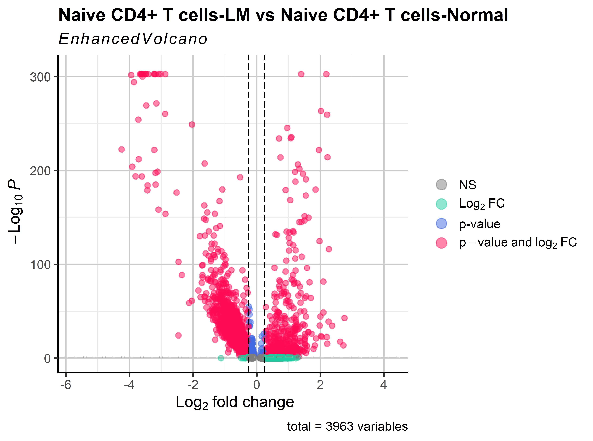

---

## 06. Heatmap

This script generates gene-specific heatmaps to visualize gene expression patterns across cell types and conditions.

### Workflow

### A. Data Extraction

- Selects genes of interest for visualization
- Extracts expression data from Seurat object
- Combines expression data with metadata

### B. Expression Analysis

- Calculates average expression per cell type and condition
- Creates expression matrices for heatmap plotting
- Saves expression data for documentation

### C. Plot Generation

- Prepares annotation colors for conditions and cell types
- Uses pheatmap for clustered visualization
- Applies color schemes and formatting
- Exports high-quality heatmap images

<div style="display:flex; justify-content:space-between;">
  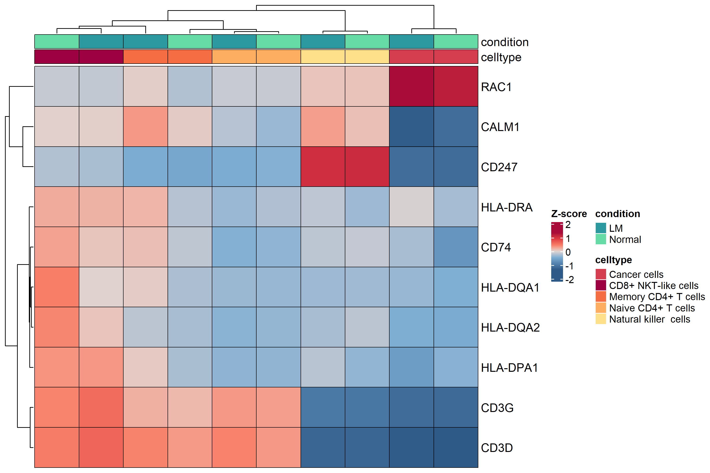
  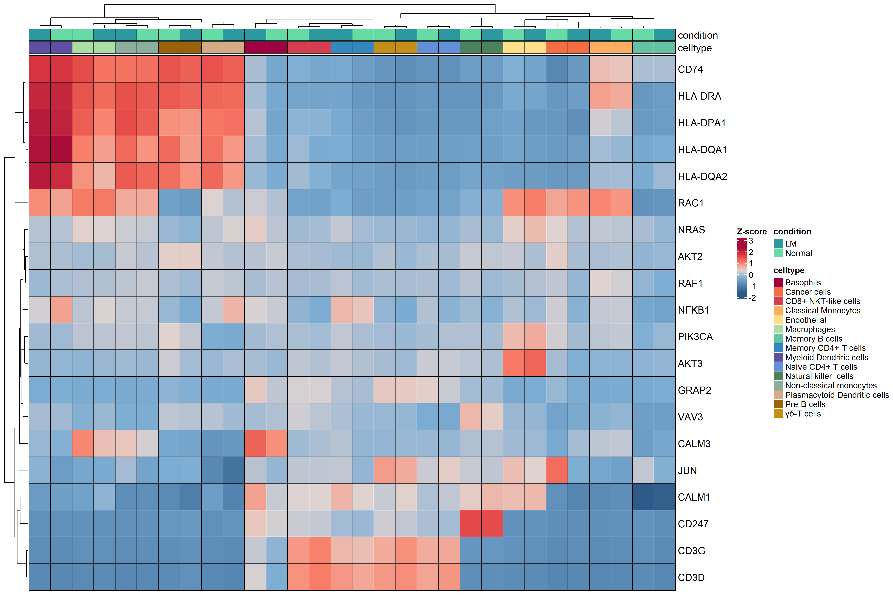
</div>

---

## 07. Boxplot

This script creates box plots to compare gene expression across conditions and specific cell types.

### Workflow

### Condition-Based Comparison

- Extracts expression data for specific genes
- Compares expression between Control and Diseased conditions
- Creates box plots with jittered points
- Applies custom color schemes

### Cell Type-Specific Analysis

- Filters data for specific cell types
- Compares expression within cell types across conditions
- Generates focused visualizations

### Visualization Customization

- Uses ggplot2 for advanced plotting
- Applies consistent theming and styling
- Creates publication-ready figures

<div style="display:flex; justify-content:space-between;">
  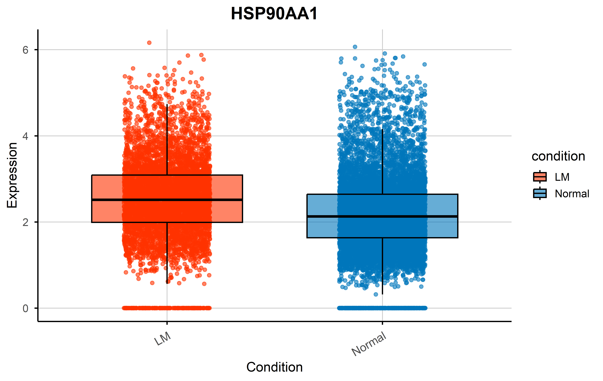
  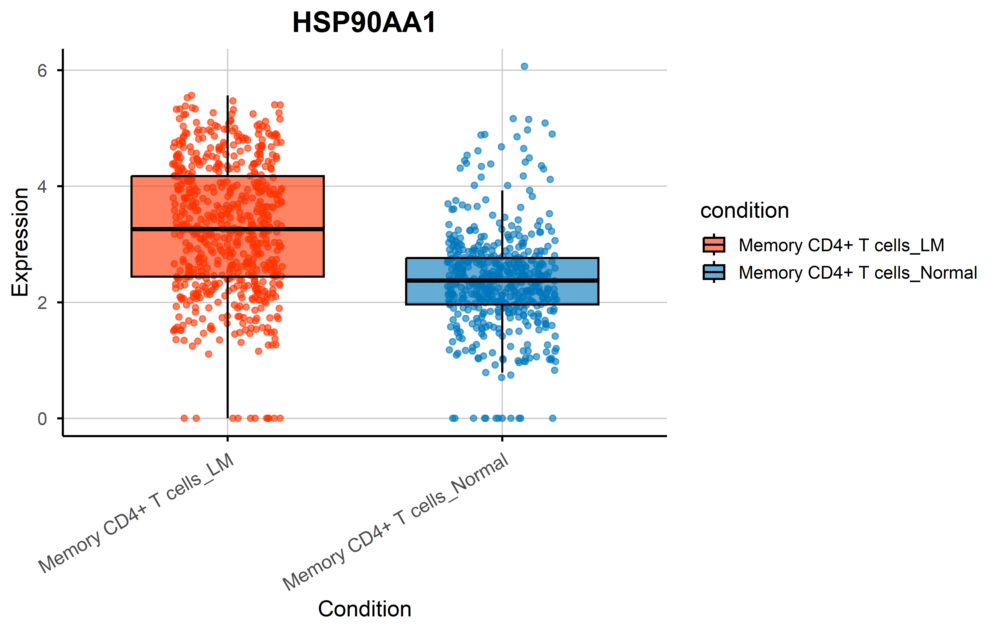
</div>

---

## 📚 Citation

- If you use this analysis pipeline in your work, please cite the repository:

```
scRNA-seq-navigator. GitHub: https://github.com/usman4373/scRNA-seq-navigator
```

## 🤝 Acknowledgements

- <p align="justify"> This pipeline implements established single-cell analysis methods, including <a href="https://doi.org/10.1016/j.cell.2019.05.031">Seurat (Stuart et al., 2019)</a>, <a href="https://doi.org/10.1038/s41592-019-0619-0">Harmony (Korsunsky et al., 2019)</a>, and <a href="https://doi.org/10.1038/s41467-022-28803-w">ScType (Ianevski et al., 2022)</a>. Please also cite the original publications of these tools when using their respective functionalities in your research. </p>
- Please also cite other tools used in the analysis pipeline:
    - dplyr - For efficient data manipulation and transformation
    - patchwork - For seamless arrangement of multiple ggplot2 plots
    - ggplot2 - For creating elegant and customizable data visualizations
    - openxlsx - For reading and writing Excel files in R
    - HGNChelper - For handling and validating HGNC gene symbols
    - plotly - For creating interactive web-based visualizations
    - ComplexHeatmap - For generating sophisticated and annotated heatmaps
    - circlize - For circular visualization and heatmap enhancements
    - paletteer - For accessing comprehensive color palette collections
    - EnhancedVolcano - For publication-ready volcano plot generation
    - viridis - For colorblind-friendly color scales in visualizations
    - htmlwidgets - For embedding interactive JavaScript visualizations in R
    - webshot2 - For converting interactive plots to static images
    - readr - For fast and tidy data import functionality
    - Other open-source R packages and dependencies

---
